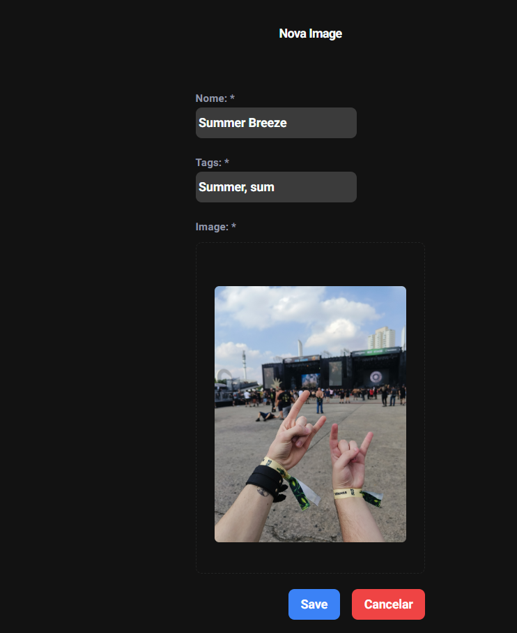
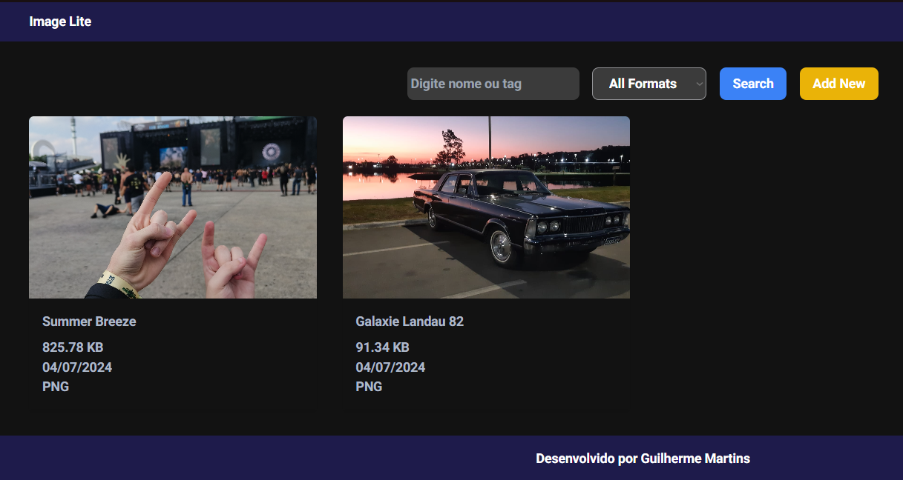

# Projeto-React-Java

## Sobre 
### Este projeto consiste em uma aplicação full-stack com back-end desenvolvido em Java, front-end desenvolvido em React.JS e banco de dados PostgreSQL

## Como executar localmente
### Basta baixar do repositório e executar o arquivo start.sh, por exemplo em um terminal bash basta executar: "bash start.sh"

## Pré-requisitos
### Docker instalado

<h1 align="center">
    
</h1>
<h1 align="center">
    
</h1>

